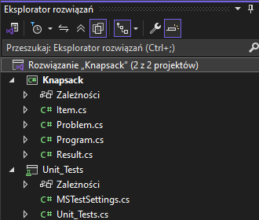
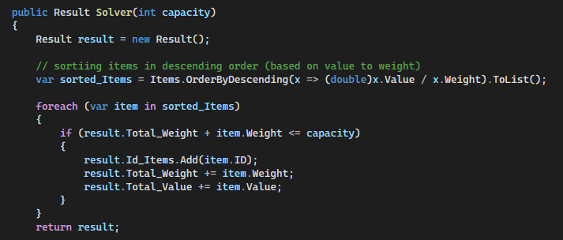

# Algorytm Zachłanny - Problem Plecakowy (Knapsack)
Autor: Hubert Missar
Indeks: 280110
Repozytorium: https://github.com/MesnerH/Platformy_programistyczne_Net_i_Java

## Opis projektu
Program generuje listę przedmiotów o losowych wagach i wartościach, a następnie optymalizuje zawartość plecaka tak, aby uzyskać jak największą wartość, a zarazem nie przekroczyć dopuszczalnej wagi. 
W projekcie znajduje się zestaw pięciu testów jednostkowych:
- Test_One_Item_Returned: Sprawdza, czy algorytm zwraca przedmiot, gdy pojemność na to pozwala.
- Test_No_Items_Returned: Sprawdza, czy dla pojemności zero wynik jest pusty.
- Test_Specific_Instance: Sprawdza wynik konkretnej instancji.
- Test_Total_Weight_Dont_Exceeds_Capacity: Sprawdza, czy suma wag nie przekracza pojemności.
- Test_All_Items_Taken_In_Knapsack: Sprawdza, czy algorytm zabiera wszystkie przedmioty.

### Kluczowe klasy
`Item`: Reprezentuje pojedyncny przedmiot posiadający swoje ID, wagę oraz wartość.
`Problem`: Odpowiada za generowanie instancji problemu.
`Result`: Przechowuje rozwiązanie czyli, listę ID spakowanych przedmiotów oraz ich łączną wartość i wagę.

### Kluczowa metoda
`Solver(int capacity)`: Sortowanie przedmiotów malejąco według współczynnika wartość/waga.

## Struktura projektu

## Kluczowy fragment programu

