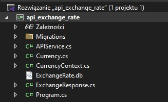
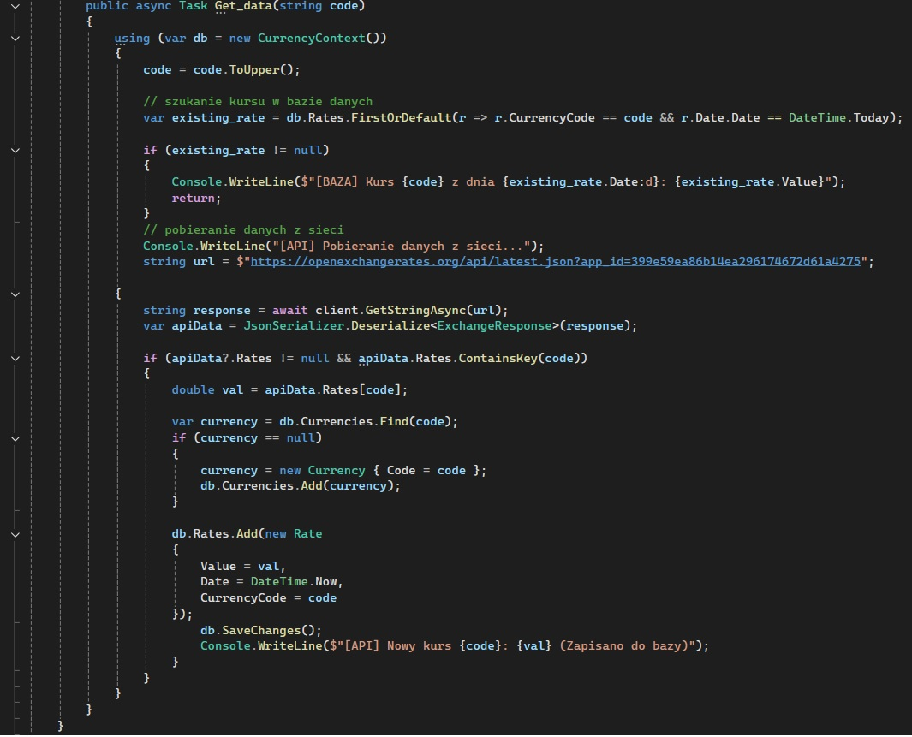

# API Exchange Rate
**Autor:** Hubert Missar  
**Indeks:** 280110  
**Repozytorium:** https://github.com/MesnerH/Platformy_programistyczne_Net_i_Java

## Opis projektu
Program służy do pobierania, przechowywania i wyświetlania kursów walut z API OpenExchangeRates.org. Aplikacja pobiera dane o kursach walut (np. USD, EUR, GBP), zapisuje je w lokalnej bazie danych SQLite przy użyciu Entity Framework Core, a następnie wyświetla historię pobrań w konsoli.

### Funkcjonalności:
* **Pobieranie danych:** Komunikacja z API za pomocą `HttpClient`.
* **Baza danych:** Zapisywanie wyników do lokalnego pliku bazy `ExchangeRate.db`.
* **Relacje EF Core:** Wykorzystanie powiązanych tabel zarządzanych przez Entity Framework.
* **Wyświetlanie:** Prezentacja pobranych kursów z podziałem na walutę, kod oraz datę.

## Kluczowe klasy
* **Currency**: Klasa bazowa reprezentująca walutę.
* **ExchangeResponse**: Klasa służąca do mapowania odpowiedzi z API – zawiera nazwę waluty, jej kod oraz listę kursów.
* **CurrencyContext**: Serce bazy danych. Klasa dziedzicząca po `DbContext`, która zarządza tabelami i połączeniem.
* **ApiService**: Klasa odpowiedzialna za logikę zewnętrzną – pobiera dane JSON i deserializuje je na obiekty C#.

### Kluczowa metoda
`OnConfiguring(DbContextOptionsBuilder options)`: Konfiguracja połączenia z bazą SQLite.

## Struktura projektu

## Kluczowy fragment programu

