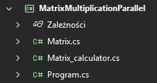
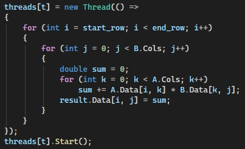

# MatrixMultiplication
**Autor:** Hubert Missar  
**Indeks:** 280110  
**Repozytorium:** https://github.com/MesnerH/Platformy_programistyczne_Net_i_Java

## Opis projektu
Program służy do przeprowadzania obliczeń matematycznych na dużych zbiorach danych przy wykorzystaniu wielowątkowości. Aplikacja wykonuje mnożenie macierzy kwadratowych, porównując wydajność wysokopoziomowej biblioteki TPL (Task Parallel Library) z niskopoziomowym zarządzaniem wątkami systemowymi za pomocą klasy Thread.

### Funkcjonalności:
* **Obliczenia równoległe:** Wykorzystanie pętli `Parallel.For` do optymalnego rozdzielenia zadań na rdzenie procesora.
* **Zarządzanie niskopoziomowe:** Ręczne tworzenie i synchronizacja obiektów klasy `Thread`.
* **Analiza wydajności:** Automatyczny pomiar czasu z dokładnością do milisekund i generowanie tabeli porównawczej.
* **Badanie skalowalności:** Obliczanie przyspieszenia dla różnej liczby wątków.

## Kluczowe klasy
* **Matrix**: Klasa reprezentująca macierz, odpowiedzialna za przechowywanie danych, losowe wypełnianie wartości.
* **Matrix_calculator**: Silnik obliczeniowy projektu. Zawiera metody implementujące różne podejścia do mnożenia macierzy.
* **Program**: Główny punkt wejścia aplikacji, zarządzający pętlą testową i formatowaniem wyników w konsoli.

### Kluczowa metoda
`Multiply(A, B, threads)`: Wykorzystuje `Parallel.For` z ograniczeniem `MaxDegreeOfParallelism`.
`Multiply_threads(A, B, threads)`: Implementuje manualny podział wierszy macierzy pomiędzy listę wątków.

## Struktura projektu

## Kluczowy fragment programu

