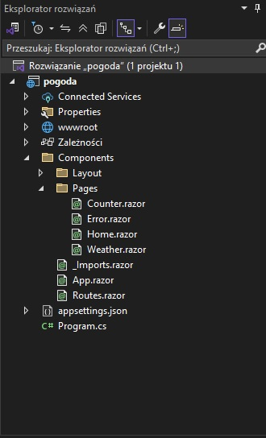
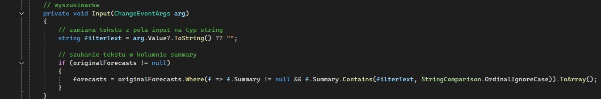

# BlazorWebMLApp
**Autor:** Hubert Missar  
**Indeks:** 280110  
**Repozytorium:** https://github.com/MesnerH/Platformy_programistyczne_Net_i_Java

## Opis projektu
Aplikacja webowa stworzona w technologii **ASP.NET Core Blazor** przy użyciu interaktywnego trybu renderowania po stronie serwera (`InteractiveServer`). Głównym załoźeniem projektu jest modyfikacja i rozbudowa domyślnego komponentu `Weather` odpowiedzialnego za prognozę pogody oraz implementacja algorytmu filtrowania danych w czasie rzeczywistym.

### Funkcjonalności:
* **Rozbudowana prognoza pogody:** Wydłużenie domyślnego czasu prognozy do 10 dni w komponencie Weather.
* **Dynamiczne zliczanie danych:** Implementacja licznika dni ciepłych (z temperaturą powyżej 15°C) bezpośrednio podczas inicjalizacji danych.
* **Filtrowanie kolekcji:** Dodanie przycisku filtrującego, który usuwa z tabeli dni o temperaturze poniżej 15°C.
* **Funkcja przywracania stanu (Restore):** Możliwość zresetowania filtrów i powrotu do pełnej, pierwotnej tabeli prognoz.
* **Wyszukiwanie i filtrowanie tekstowe:** Implementacja pola `<input>` pozwalającego na filtrowanie wyników po wpisanej nazwie.

## Kluczowe komponenty
* **Weather.razor**: Komponent odpowiedzialny za wyświetlanie prognozy, zliczanie ciepłych dni oraz działanie filtrów.
* **Program.cs**: Główny plik startowy aplikacji, w którym skonfigurowano bezpieczne połączenie HTTPS i certyfikaty.

### Kluczowe metody i dyrektywy
* `CountWarmDays()`: Zlicza dni z temperaturą powyżej 15°C.
* `WarmDaysFilter()`: Odfiltrowuje i zostawia w tabeli wyłącznie dni z temperaturą powyżej 15°C.
* `Restore()`: Przywraca pełną listę prognoz z zachowanej kopii zapasowej.
* `Input(ChangeEventArgs arg)`: Przechwytuje tekst wpisany przez użytkownika i filtruje tabelę po kolumnie `Summary` (używając metody `Contains`).

## Struktura projektu

## Kluczowy fragment programu

