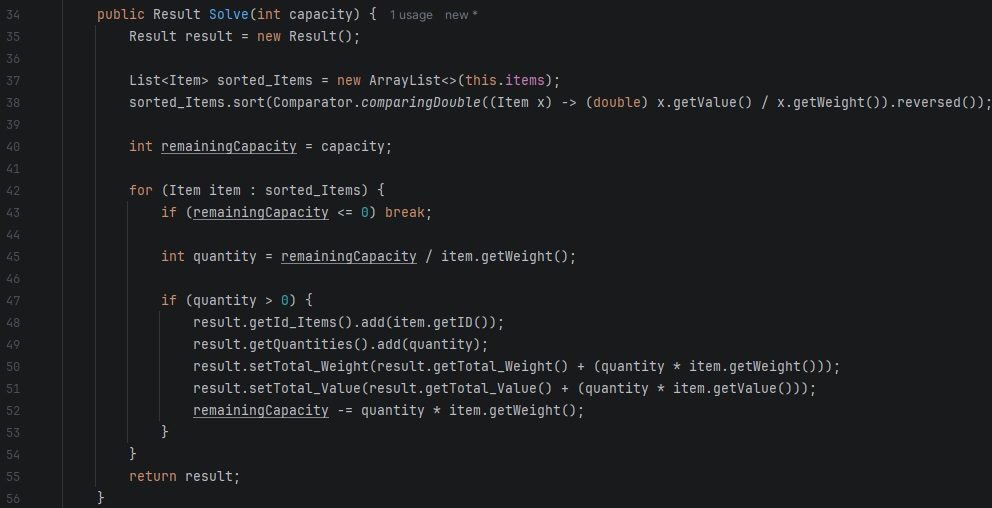

# Algorytm Zachłanny - Nieograniczony Problem Plecakowy (Knapsack)
Autor: Hubert Missar
Indeks: 280110
Repozytorium: https://github.com/MesnerH/Platformy_programistyczne_Net_i_Java

## Opis projektu
Program rozwiązuje nieograniczony problem plecakowy przy użyciu algorytmu zachłannego Dantziga. Aplikacja generuje listę przedmiotów o losowych wagach i wartościach w zadanym przedziale, a następnie optymalizuje zawartość plecaka tak, aby uzyskać jak największą wartość sumaryczną, nie przekraczając dopuszczalnej pojemności. 

Wariant nieograniczony pozwala na pakowanie wielokrotności tego samego rodzaju przedmiotu (aż do całkowitego wyczerpania wolnego miejsca). Dane wejściowe takie jak ziarno losowania (`seed`), liczba przedmiotów (`n`), zakres losowania oraz pojemność plecaka są wprowadzane interaktywnie przez użytkownika w konsoli.

### Kluczowe klasy
* `Item`: Model danych reprezentujący pojedynczy rodzaj przedmiotu, posiadający unikalne ID, wagę oraz wartość.
* `Problem`: Odpowiada za generowanie losowej instancji testowej oraz zawiera logikę biznesową algorytmu.
* `Result`: Klasa z końcowymi wynikami algorytmu.
### Kluczowa metoda
* `Solve(int capacity)`: Metoda w klasie `Problem`. Dokonuje sortowania dostępnych przedmiotów malejąco według współczynnika opłacalności (stosunek wartość/waga), a następnie w pętli dokłada najbardziej opłacalne przedmioty w ramach dostępnej pojemności plecaka.

## Struktura projektu

## Kluczowy fragment programu

