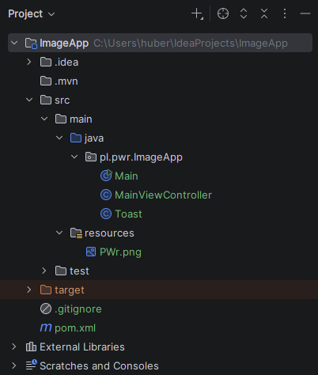
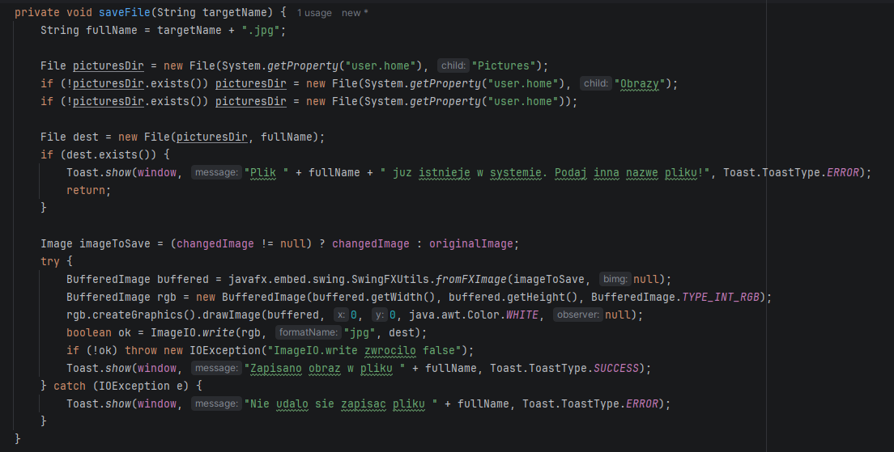
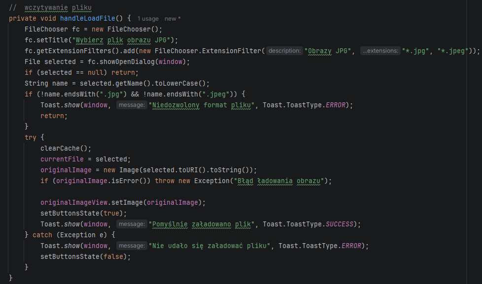

# ImageApp
Autor: Hubert Missar  
Indeks: 280110  
Repozytorium: https://github.com/MesnerH/Platformy_programistyczne_Net_i_Java

## Opis projektu
Aplikacja okienkowa napisana w technologii JavaFX umożliwiająca wczytywanie plików obrazów w formacie `.jpg`, wykonywanie operacji przetwarzania obrazu oraz zapis wynikowego pliku. Aplikacja obsługuje operacje takie jak negatyw, skala szarości, progowanie oraz konturowanie.

### Kluczowe klasy
* `Main`: Punkt wejścia aplikacji, inicjalizuje okno JavaFX i ustawia minimalny rozmiar sceny.
* `MainViewController`: Główna klasa kontrolera odpowiedzialna za budowę interfejsu użytkownika, obsługę zdarzeń oraz logikę wszystkich operacji przetwarzania obrazu.
* `Toast`: Klasa pomocnicza wyświetlająca krótkie komunikaty typu toast.

### Kluczowe metody
* `handleLoadFile()`: Odpowiada za wczytanie pliku obrazu z dysku.
* `saveFile(String targetName)`: Odpowiada za zapis przetworzonego obrazu na dysk.

## Struktura projektu

## Kluczowe fragmenty programu

